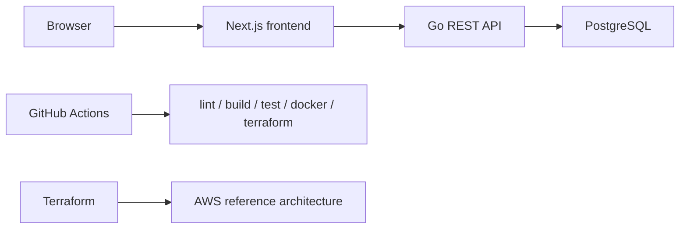
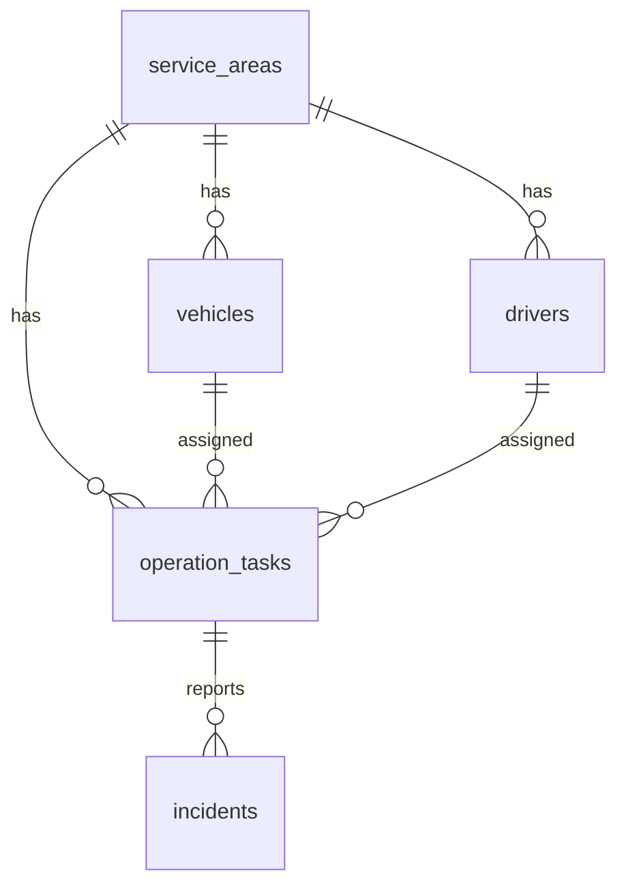
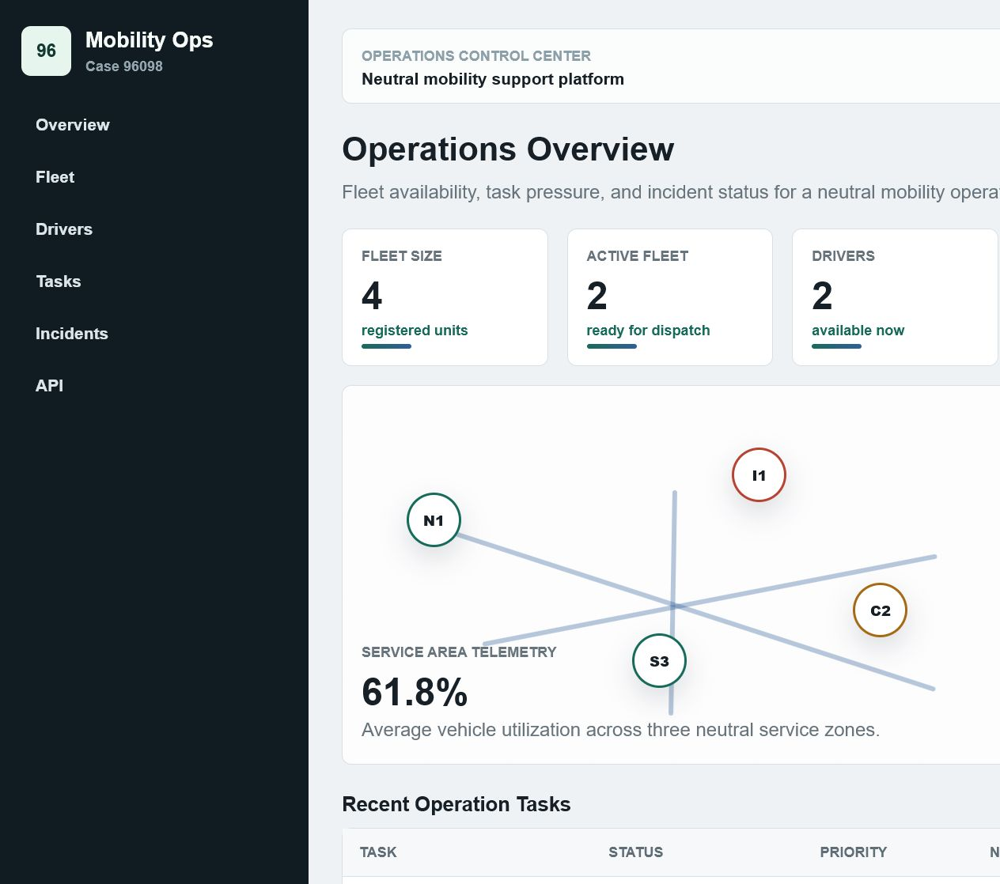
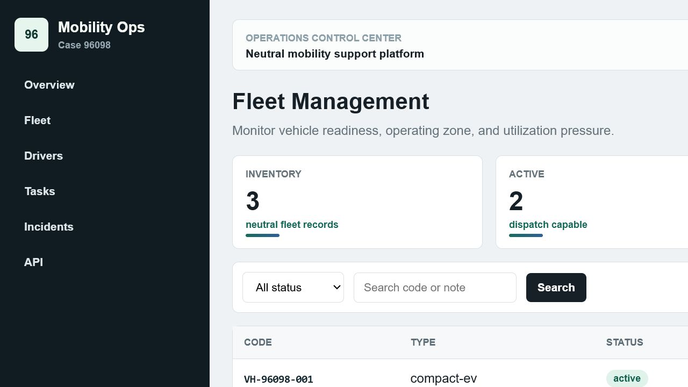
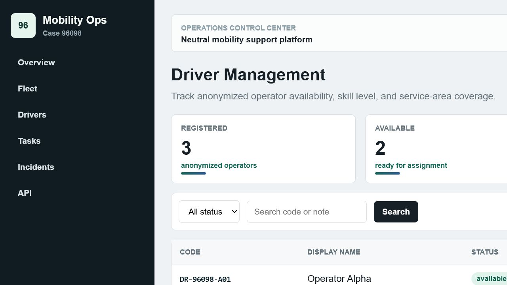
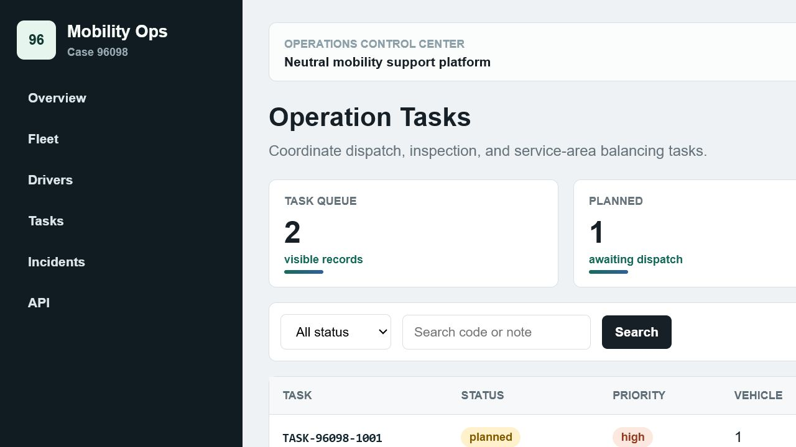

# 96098-mobility-operations-platform

移動出行運営管理プラットフォームを題材にした GitHub Portfolio プロジェクトです。Go、Next.js / TypeScript、PostgreSQL、Docker、Terraform、GitHub Actions、GitHub Projects 風の開発管理をまとめて示します。

## 1. プロジェクト概要

このシステムは企業内部向けの中立的な運転・車両運用支援を想定した管理画面と API です。実在企業名、実在サービス名、実在顧客名、実データは含みません。

## 2. プロジェクト背景

移動サービスの運営では、車両状態、担当者状態、運行タスク、異常イベント、稼働率を横断的に確認する必要があります。本プロジェクトでは、その業務理解を Portfolio として説明可能な形に整理しています。

## 3. 対応技術スタック

| 分野 | 実装 |
| --- | --- |
| Go backend | `backend/` REST API、CRUD、health、dashboard summary |
| Next.js / TypeScript | `frontend/` Dashboard と管理画面 |
| PostgreSQL | migration、seed、ER 説明 |
| AWS | Terraform に VPC、Subnet、SG、RDS、ECR、App Runner、CloudWatch |
| Terraform IaC | `infrastructure/terraform/` |
| GitHub Actions | `.github/workflows/ci.yml` |
| Project management | Backlog -> Issue -> Branch -> Pull Request -> Review -> Merge |

## 4. システム架構図



## 5. 技術スタック一覧

- Frontend: Next.js 14, TypeScript, React
- Backend: Go 1.22, net/http, database/sql, lib/pq
- Database: PostgreSQL 16
- Infrastructure: AWS, Terraform
- CI/CD: GitHub Actions
- Local runtime: Docker Compose

## 6. 目录结构说明

詳細は `docs/project-structure.md` を参照してください。

## 7. Frontend 機能

- Dashboard
- 車両管理
- ドライバー管理
- 運行タスク一覧
- 運行タスク詳細
- 異常イベント管理
- API 呼び出し例
- status filter と search query

## 8. Backend 機能

- REST API
- 車両 CRUD
- ドライバー create/list
- 運行タスク CRUD
- 異常イベント create/list
- Dashboard 統計 API
- Health check
- ログ出力
- 安全なエラーレスポンス
- 基礎単体テスト

## 9. DB 設計説明

主要テーブルは `vehicles`、`drivers`、`operation_tasks`、`service_areas`、`incidents`、`operation_logs` です。



## 10. API 一覧

| Method | Path |
| --- | --- |
| GET | `/health` |
| GET/POST | `/api/vehicles` |
| GET/PUT/DELETE | `/api/vehicles/{id}` |
| GET/POST | `/api/drivers` |
| GET/PUT/DELETE | `/api/drivers/{id}` |
| GET/POST | `/api/operation-tasks` |
| GET/PUT | `/api/operation-tasks/{id}` |
| GET/POST | `/api/incidents` |
| GET/PUT/DELETE | `/api/incidents/{id}` |
| GET | `/api/dashboard/summary` |

## 11. AWS 架構説明

Terraform は VPC、Subnet、Security Group、ECR、RDS PostgreSQL、CloudWatch Logs、App Runner を表現します。ローカルで実 AWS resource は作成しません。

## 12. Terraform 使用方法

```bash
cd infrastructure/terraform
terraform fmt -check -recursive
terraform init -backend=false
terraform validate
```

## 13. GitHub Actions CI/CD

CI は frontend lint/build、backend test/build、Docker build check、Terraform format/validate を行います。Secrets は出力しない設計です。

## 14. GitHub Projects 運用

Backlog に要求を登録し、Issue 化、branch 作成、Pull Request、review、merge の流れで管理します。

## 15. ローカル実行方法

```bash
docker compose up -d postgres
cd backend && go run ./cmd/server
cd ../frontend && npm install && npm run dev
```

## 16. Docker 実行方法

```bash
docker compose up --build
```

## 17. テスト方法

```bash
cd backend
go test ./...
cd ../frontend
npm run lint
npm run build
```

## 18. 主要功能说明

Dashboard は稼働率、未完了タスク、未解決異常を表示します。管理画面は status と keyword による絞り込みを提供します。

## 19. セキュリティ考慮

- `.env.example` のみをコミットし、実 secret はコミットしません。
- DB password は環境変数または Terraform sensitive variable で扱います。
- API error は内部詳細を隠します。
- CORS は `ALLOWED_ORIGIN` で制限します。
- GitHub Actions は secret を echo しません。

## 20. ログ設計

Go API は method/path と内部エラーを標準出力へ記録します。AWS では CloudWatch Logs に集約する想定です。

## 21. 今後拡張方向

- 認証・認可
- 監査ログ検索
- タスク割当最適化
- OpenAPI 仕様
- E2E テスト
- Terraform module 分割

## 22. 実行結果スクリーンショット







生成手順:

```bash
npm install
npx playwright install chromium
npm run screenshots
```
