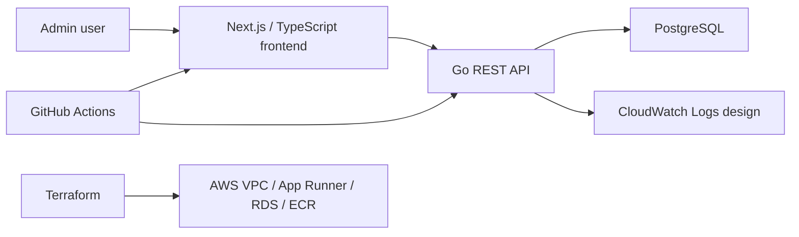

# Architecture

## システム構成図

## コンポーネント説明

- Frontend: Dashboard、車両、ドライバー、運行タスク、異常イベント、API 呼び出し例を提供します。
- Backend: Go 標準 `net/http` と Repository/Service/Handler 分離で REST API を提供します。
- Database: PostgreSQL に車両、担当者、タスク、エリア、異常、操作ログを保存します。
- AWS: Terraform で VPC、Subnet、Security Group、RDS、ECR、App Runner、CloudWatch Logs を表現します。

## データフロー

1. 管理画面が `/api/*` を呼び出します。
2. Go handler が入力を検証し、service に渡します。
3. service は業務境界を保ち、repository が PostgreSQL を操作します。
4. エラー時は内部詳細を隠した JSON を返します。

## Docker 構成

`docker-compose.yml` は `frontend`、`backend`、`postgres` を起動します。PostgreSQL は migration と seed SQL を初期化時に読み込みます。

## AWS 配置

Portfolio の参照設計では App Runner で API コンテナを公開し、RDS PostgreSQL を private 接続先にします。ECR は backend image の保管先、CloudWatch Logs は API ログの集約先です。
